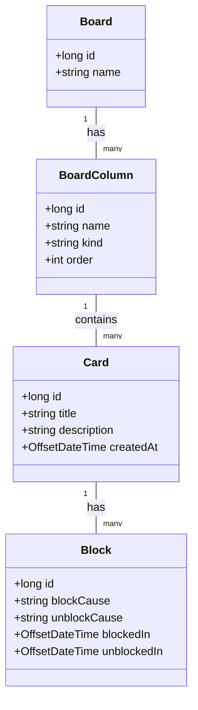

# taskBoss

## Class diagram

```mermaid
classDiagram
    class Board {
        +long id
        +string name
    }
    
    class BoardColumn {
        +long id
        +string name
        +string kind
        +int order
    }
    
    class Card {
        +long id
        +string title
        +string description
        +OffsetDateTime createdAt
    }
    
    class Block {
        +long id
        +string blockCause
        +string unblockCause
        +OffsetDateTime blockedIn
        +OffsetDateTime unblockedIn
    }

    Board "1" -- "many" BoardColumn : has
    BoardColumn "1" -- "many" Card : contains
    Card "1" -- "many" Block : has

```
